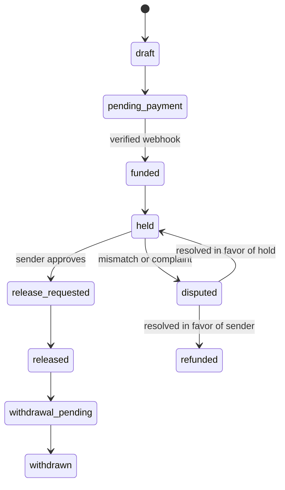

# Escrow Architecture

## Purpose

Verinest escrow should behave as a reusable payment service that can support bookings, deposits, rent, and future paid workflows without rewriting the core money flow each time.

## Core Principle

The application should never treat frontend state as the source of truth for funds. Every money movement must be backed by:

- a payment provider reference
- a server-side ledger entry
- a webhook-confirmed status change
- an audit trail

## Recommended Layers

### 1. Payment Orchestration

This layer talks to the payment provider.

Responsibilities:

- create payment references
- initialize collections
- verify webhook signatures
- reconcile status changes
- prevent duplicate processing with idempotency keys

### 2. Escrow Ledger

This is the internal record of truth.

It should track:

- principal amount
- escrow fee
- net release amount
- status transitions
- dispute locks
- withdrawal requests

### 3. Domain Adapters

Each product flow should reuse the same escrow engine through adapters.

Examples:

- booking escrow
- rent deposit escrow
- service escrow
- maintenance escrow
- future marketplace payments

## State Flow

## Fee Handling

Verinest should separate the fee from the principal in the ledger.

- principal: exact object amount
- escrow fee: 2%
- net release: principal minus fee policy, if applicable

## Security Requirements

- Verify every webhook signature.
- Use idempotency keys for collection and payout calls.
- Never trust a frontend success response as final payment confirmation.
- Keep a full audit log for every transition.
- Reconcile regularly against provider records.

## Reusability

The escrow API should operate on a generic payable object, not only properties.

Suggested fields:

- purpose_type
- purpose_id
- payer_id
- payee_id
- amount
- currency
- fee_amount
- status
- release_rule
- dispute_id

## Deployment Note

If Verinest later introduces wallet-like balances or withdrawals, the regulatory and PSP structure should be reviewed before launch.
