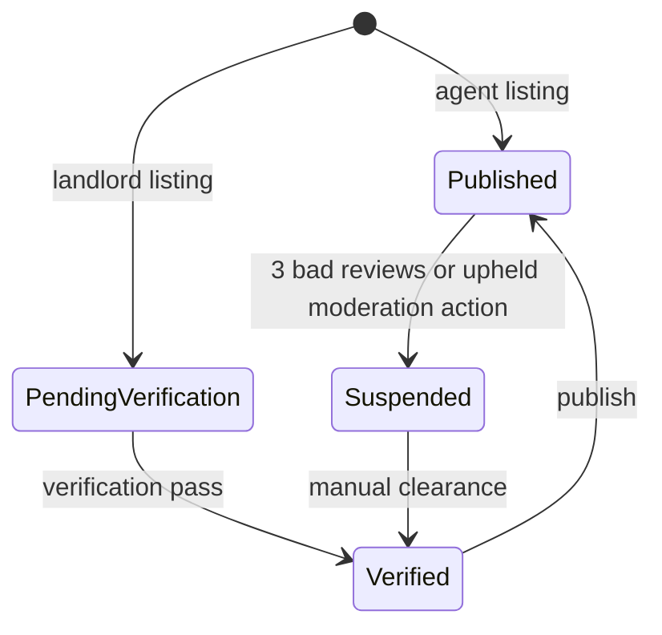

# Listing And Trust Policy

## Listing Policy

- Agent-listed properties publish immediately.
- Landlord-listed properties enter `pending_verification`.
- Landlord properties that request an agent stay under verification until approved, then the landlord can assign an agent.
- Service apartments can include mixed media URLs in the existing `images` array. The backend stores URLs; the frontend can render image or video based on file type.

## Property Lifecycle

## Review Policy

- A review with rating `1` or `2` is treated as a bad review for property quality scoring.
- When a property reaches `3` bad reviews, the backend suspends it automatically.
- Suspended properties disappear from public listing endpoints.

## Report Policy

- Reports are created by users and reviewed internally.
- Internal moderation can mark a report as:
  - `upheld`
  - `dismissed`
- Reports must include a violation type:
  - `quality`
  - `fraud`
  - `other`

## Enforcement

### Quality violations

- Upheld quality reports increase the reported user’s quality strike count.
- At `2` quality strikes, the user is temporarily blocked from listing new properties for 7 days.
- At `3` quality strikes, the user is blocked for 30 days.
- If the same property accumulates `3` upheld quality reports, the property is suspended.

### Fraud violations

- An upheld fraud report suspends the associated property immediately when a property is attached.
- Upheld fraud reports increase the reported user’s fraud strike count.
- At `1` fraud strike, the user is blocked from new listings for 30 days.
- At `3` fraud strikes, the user account is banned.

## Agent Verification For MVP

- Tier 1: verified email and verified phone outside this backend
- Tier 2: manual review of NIN or driver’s license
- Tier 3 later: selfie or facial verification and stronger business proof

This repo currently implements the trust-policy enforcement and moderation path. Identity-document workflow remains a product policy item and can be added as a separate verification module.
